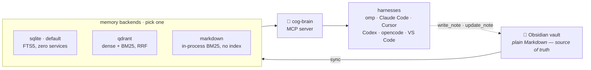

<div align="center">

# 🧠 cog-brain

**Your Obsidian vault, as long-term memory for any coding agent.**

One MCP server. Pluggable storage. Plain Markdown you own.


</div>

---

cog-brain turns a folder of Markdown notes into a **second brain your agent can
search, read, extend and maintain** — through the standard Model Context Protocol,
so it drops into omp, Claude Code, Cursor, Codex, opencode, VS Code and anything
else that speaks MCP.

The vault is the source of truth — plain, human-editable Markdown. The index is
derived and rebuildable. The **storage engine is swappable** without changing a
single tool. That combination is the point: Markdown-first tools usually have weak
retrieval; vector tools usually aren't human-editable.

> `cog-brain` is the product. `~/SECOND_BRAIN` is just the default vault it points at.

## How it works



Writes re-index automatically. Retracted notes stay searchable and are flagged.
The same tool surface works on every backend.

## Install

### 🧩 As a plugin (recommended)

```bash
# oh-my-pi
omp plugin marketplace add cog-sh/cog-brain-plugins
omp plugin install cog-brain@cog-brain-plugins

# Claude Code
claude plugin marketplace add cog-sh/cog-brain-plugins
claude plugin install cog-brain@cog-brain-plugins
```

The plugin registers the server, the skill, and the `/brain-*` commands. Nothing to clone.

### 🔌 Plain MCP client

```json
{
  "mcpServers": {
    "cog-brain": {
      "type": "stdio",
      "command": "uvx",
      "args": ["--from", "git+https://github.com/cog-sh/cog-brain", "cog-brain"],
      "env": { "COG_BRAIN_BACKEND": "sqlite" }
    }
  }
}
```

Or let cog-brain write it for you:

```bash
cog-brain mcp-config --harness cursor        # paste-ready snippet
cog-brain install --harness codex            # merge into ~/.codex/config.toml
```

### 🛠️ From source

```bash
git clone https://github.com/cog-sh/cog-brain && cd cog-brain
uv sync
uv run cog-brain-index        # build the index
uv run cog-brain doctor       # check vault + backend
```

## Memory backends

Pick the engine with `COG_BRAIN_BACKEND` (or `--backend`).

| backend | storage | needs | ranking |
| --- | --- | --- | --- |
| **`sqlite`** *(default)* | one SQLite file | nothing | FTS5 BM25 |
| `qdrant` | Qdrant collection | Qdrant + an embedding endpoint | dense + BM25, RRF |
| `markdown` | none — the filesystem *is* the index | nothing | in-process BM25 |

Adding one is a single module implementing the `Backend` protocol
(`sync` · `search` · `status` · `reset` · `health`). See `src/cog_brain/backends/`.

## Operator CLI

```bash
cog-brain status                 # index health: notes on disk vs indexed, staleness
cog-brain health                 # 4 metrics with verdicts (orphans, degree, connectivity, stale)
cog-brain lint                   # broken links · orphans · stubs · missing frontmatter
cog-brain doctor                 # diagnose vault, state dir, active backend
cog-brain graph --export graphml # export the wiki-link graph (type as node attr)
cog-brain inspect query "…" -k 10
cog-brain ingest chats export.json
cog-brain backends | reindex | mcp-config | install
```

## MCP tools

- **read** — `semantic_search`, `outline`, `read_note`, `find_related`, `backlinks`,
  `broken_links`, `graph_overview`, `list_notes`, `vault_status`
- **write** — `write_note`, `update_note`
- **index** — `index_now`

## Configuration

| variable | meaning | default |
| --- | --- | --- |
| `COG_BRAIN_VAULT` | vault root | `~/SECOND_BRAIN` |
| `COG_BRAIN_BACKEND` | `sqlite` · `qdrant` · `markdown` | `sqlite` |
| `COG_BRAIN_STATE_DIR` | index + manifest location | `~/.local/state/cog-brain` |
| `COG_BRAIN_SQLITE_DB` | sqlite path | `<state>/sqlite.db` |
| `COG_BRAIN_QDRANT_URL` | Qdrant endpoint (`qdrant` only) | `http://127.0.0.1:6333` |
| `COG_BRAIN_OLLAMA` | embedding endpoint (`qdrant` only) | `http://127.0.0.1:11434/api/embed` |
| `COG_BRAIN_EMBED_MODEL` | embedding model (`qdrant` only) | `qwen3-embedding:0.6b` |
| `COG_BRAIN_COLLECTION` | Qdrant collection (`qdrant` only) | `cog_brain` |

## Docs

- [`docs/resources.md`](docs/resources.md) — a curated reading list (MCP, agent memory, GraphRAG, evals)
- [`AGENTS.md`](AGENTS.md) — how an agent (or contributor) works *in this repo*

## Related

- 🧩 **Plugins & skills** — <https://github.com/cog-sh/cog-brain-plugins>
